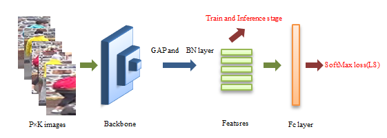
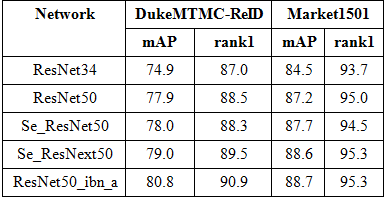
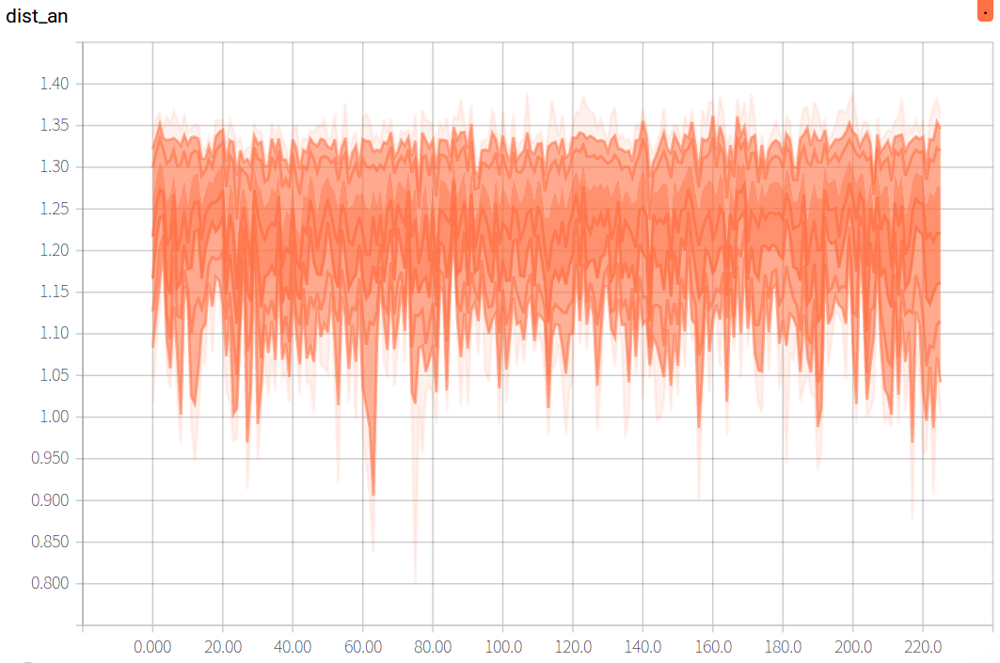
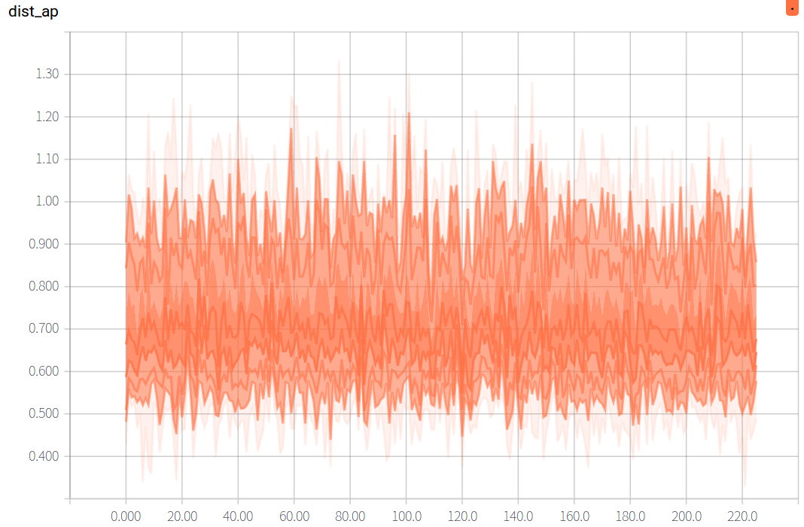
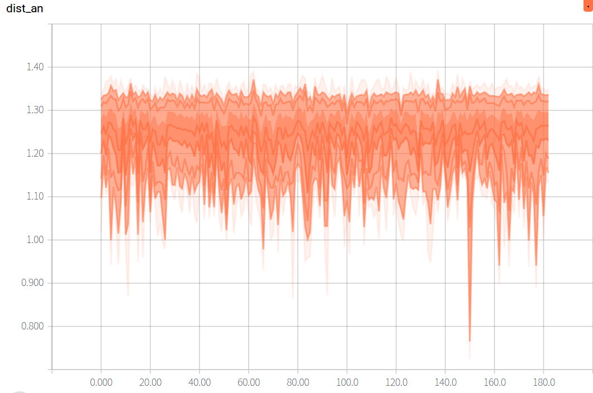
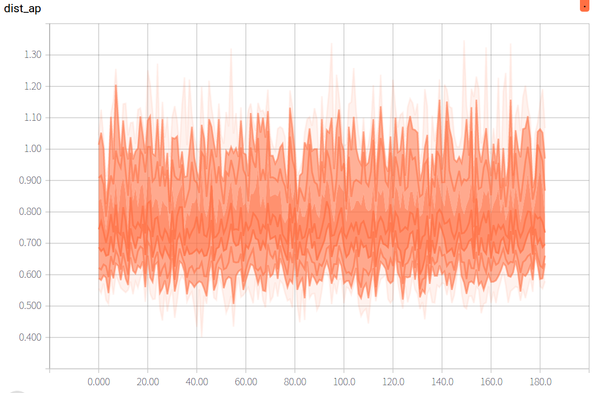

# Person ReID

The codes are expanded on a [ReID-baseline](https://github.com/michuanhaohao/reid-strong-baseline.git)

Bag of tricks
- Warm up learning rate
- Random erasing augmentation
- Label smoothing
- Last stride

## Pipeline
<div align=center>

</div>

## Results
<div align=center>

</div>

[models](https://drive.google.com/drive/folders/1CRQJYoCwx3mARckLb6dZpKzMZ_s3SwI3?usp=sharing)

NOTE: For the the limitations of the device (GTX1060 6G), while training Se_ResNet50 and Se_ResNext50 i can only set batchsize = 48, others is 64.

## Get Started

1. `cd` to folder where you want to download this repo

2. Run `git clone https://github.com/Qidian213/Ranked_Person_ReID`

3. Install dependencies:
    - [pytorch>=0.4](https://pytorch.org/)
    - torchvision
    - [ignite=0.1.2](https://github.com/pytorch/ignite) (Note: V0.2.0 may result in an error)
    - [yacs](https://github.com/rbgirshick/yacs)

4. Prepare dataset

    Create a directory to store reid datasets under this repo or outside this repo. Remember to set your path to the root of the dataset in `config/defaults.py` for all training and testing or set in every single config file in `configs/` or set in every single command.

    You can create a directory to store reid datasets under this repo via

    ```bash
    cd reid-strong-baseline
    mkdir data
    ```

    （1）Market1501

    * Download dataset to `data/` from http://www.liangzheng.org/Project/project_reid.html
    * Extract dataset and rename to `market1501`. The data structure would like:

    ```bash
    data
        market1501 # this folder contains 6 files.
            bounding_box_test/
            bounding_box_train/
            ......
    ```
    （2）DukeMTMC-reID

    * Download dataset to `data/` from https://github.com/layumi/DukeMTMC-reID_evaluation#download-dataset
    * Extract dataset and rename to `dukemtmc-reid`. The data structure would like:

    ```bash
    data
        dukemtmc-reid
        	DukeMTMC-reID # this folder contains 8 files.
            	bounding_box_test/
            	bounding_box_train/
            	......
    ```

5. Prepare pretrained model if you don't have

    （1）ResNet

    ```python
    from torchvision import models
    models.resnet50(pretrained=True)
    ```
    （2）Senet

    ```python
    import torch.utils.model_zoo as model_zoo
    model_zoo.load_url('the pth you want to download (specific urls are listed in  ./modeling/backbones/senet.py)')
    ```
    Then it will automatically download model in `~/.torch/models/`, you should set this path in `config/defaults.py` for all training or set in every single training config file in `configs/` or set in every single command.

    （3）ResNet_IBN_a , faster implementation

    You can download from here [[link]](https://github.com/XingangPan/IBN-Net)

    （4）Load your self-trained model
    If you want to continue your train process based on your self-trained model, you can change the configuration `PRETRAIN_CHOICE` from 'imagenet' to 'self' and set the `PRETRAIN_PATH` to your self-trained model.

6. If you want to know the detailed configurations and their meaning, please refer to `config/defaults.py`. If you want to set your own parameters, you can follow our method: create a new yml file, then set your own parameters.  Add `--config_file='configs/your yml file'` int the commands described below, then our code will merge your configuration. automatically.

## Train

1. Market1501

```bash
python tools/train.py --config_file='configs/softmax_ranked.yml' DATASETS.NAMES "('market1501')" 
```

2. DukeMTMC-reID


```bash
python tools/train.py --config_file='configs/softmax_ranked.yml' DATASETS.NAMES "('dukemtmc')" 
```

## Test

```bash
python tools/test.py --config_file='configs/softmax_ranked.yml' MODEL.DEVICE_ID "('your device id')" DATASETS.NAMES "('market1501')" TEST.FEAT_NORM "('yes')" MODEL.PRETRAIN_CHOICE "('self')" TEST.WEIGHT "('your path to trained checkpoints')"
```

## Using and Compute threshold of negative and postive samples

1. DukeMTMC-reID

<div align=center>

</div>

<div align=center>

</div>

2. Market1501

<div align=center>

</div>

<div align=center>

</div>

Using

```bash
python tools/demo.py 
```

Compute threshold , to compute threshold i use the hardest samples of negative and postive samples in a batchsizes.

```bash
python tools/compute_threshold.py --config_file='configs/softmax_ranked.yml' MODEL.PRETRAIN_CHOICE "('self')"  DATASETS.NAMES "('market1501')" TEST.WEIGHT "('models/resnet50_ibn_a/mar_resnet50_ibn_a_model.pth')"
```
